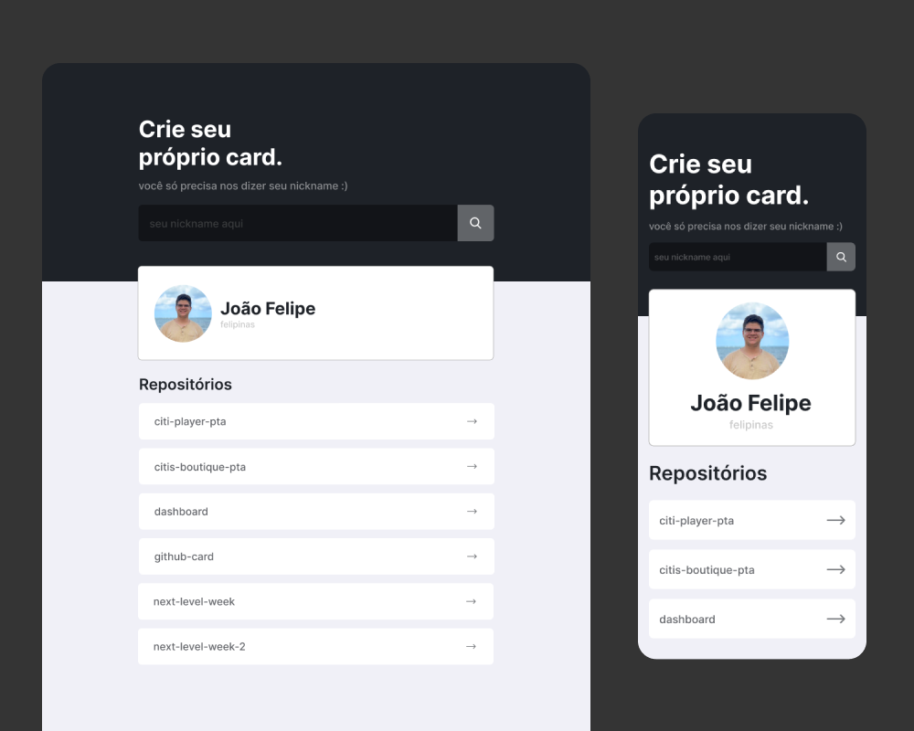

# GitHub Card e Repositórios

Esse foi um projeto pessoal com o foco de entrar mais em contato com o ambiente React e consumir API, dessa vez usando a do GitHub.

## :sparkles: Layout

Feito por mim no Figma :D

## :rocket: Tecnologias usadas

* [React](https://pt-br.reactjs.org/)
    * Hooks
* [Axios](https://www.npmjs.com/package/axios)
* Figma

## :computer: Site

* [Só clicar aqui :D](https://github-card-felipinas.vercel.app/)